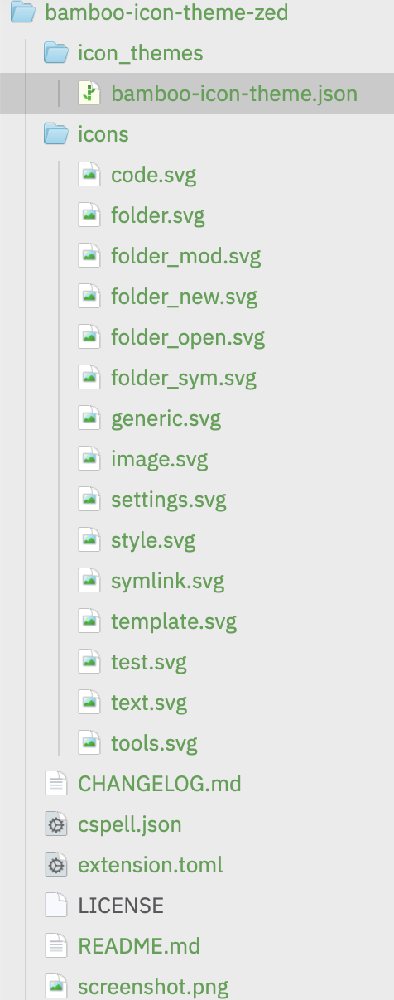

# 🎋 Bamboo Icons for Zed

Icons with color and body.

## UI/Syntax Theme

Pairs well with the [Bamboo Theme for Zed](https://github.com/chrisdrackett/bamboo-theme-zed).

## Development

1. Open Zed's command palette and run `zed: install dev extension` (also available as **Install Dev Extension** on the Extensions page).
2. Select this repository's root directory, which contains `extension.toml`.
3. Run `icon theme selector: toggle` and select **Bamboo**.
